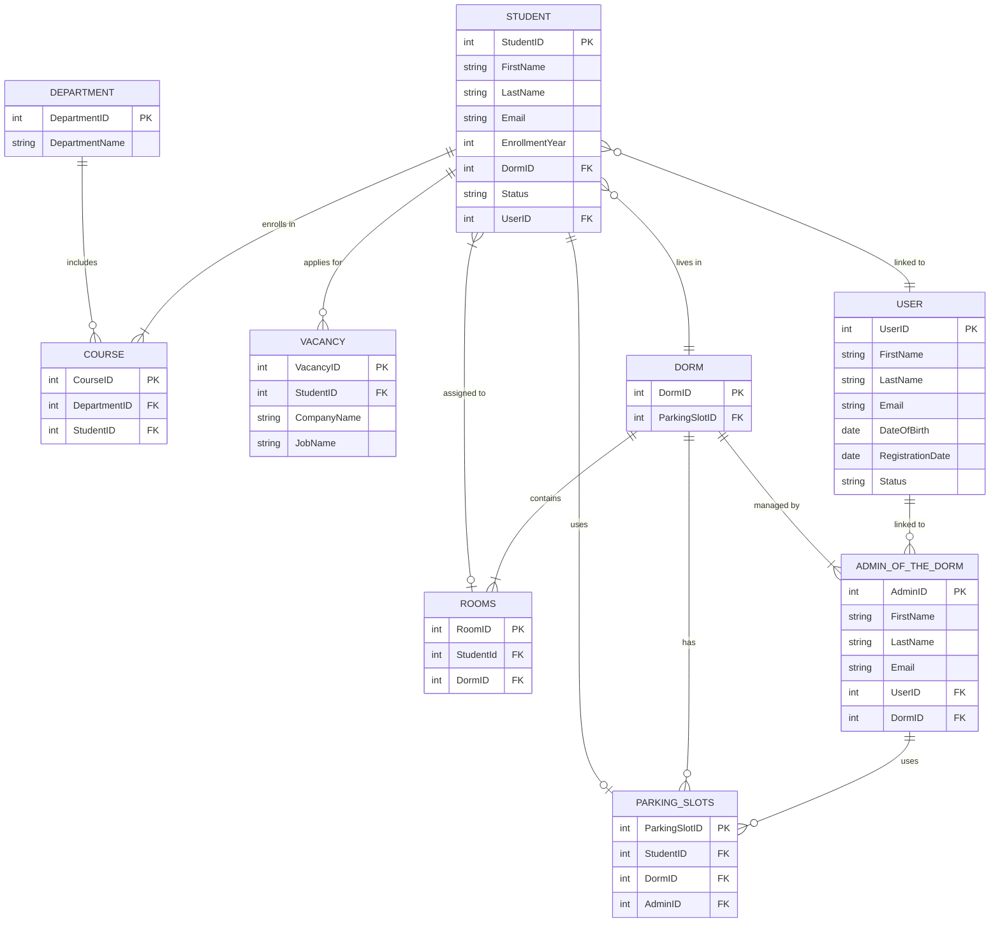

```mermaid
erDiagram
    DEPARTMENT ||--o{ COURSE : "includes"
    STUDENT ||--|{ COURSE : "enrolls in"
    STUDENT ||--o{ VACANCY : "applies for"
    STUDENT }o--|| DORM : "lives in"
    STUDENT }o--|| USER : "linked to"
    STUDENT }|--o| ROOMS : "assigned to"
    STUDENT ||--o| PARKING_SLOTS : "uses"
    DORM ||--|{ ROOMS : "contains"
    DORM ||--o{ PARKING_SLOTS : "has"
    DORM ||--|{ ADMIN_OF_THE_DORM : "managed by"
    USER ||--o{ ADMIN_OF_THE_DORM : "linked to"
    ADMIN_OF_THE_DORM ||--o{ PARKING_SLOTS : "uses"

    DEPARTMENT {
        int DepartmentID PK
        string DepartmentName
    }

    COURSE {
        int CourseID PK
        int DepartmentID FK
        int StudentID FK
    }

    VACANCY {
        int VacancyID PK
        int StudentID FK
        string CompanyName
        string JobName
    }

    STUDENT {
        int StudentID PK
        string FirstName
        string LastName
        string Email
        int EnrollmentYear
        int DormID FK
        string Status
        int UserID FK
    }

    ADMIN_OF_THE_DORM {
        int AdminID PK
        string FirstName
        string LastName
        string Email
        int UserID FK
        int DormID FK
    }

    DORM {
        int DormID PK
        int ParkingSlotID FK
    }

    ROOMS {
        int RoomID PK
        int StudentId FK
        int DormID FK
    }

    PARKING_SLOTS {
        int ParkingSlotID PK
        int StudentID FK
        int DormID FK
        int AdminID FK
    }

    USER {
        int UserID PK
        string FirstName
        string LastName
        string Email
        date DateOfBirth
        date RegistrationDate
        string Status
    }
```
